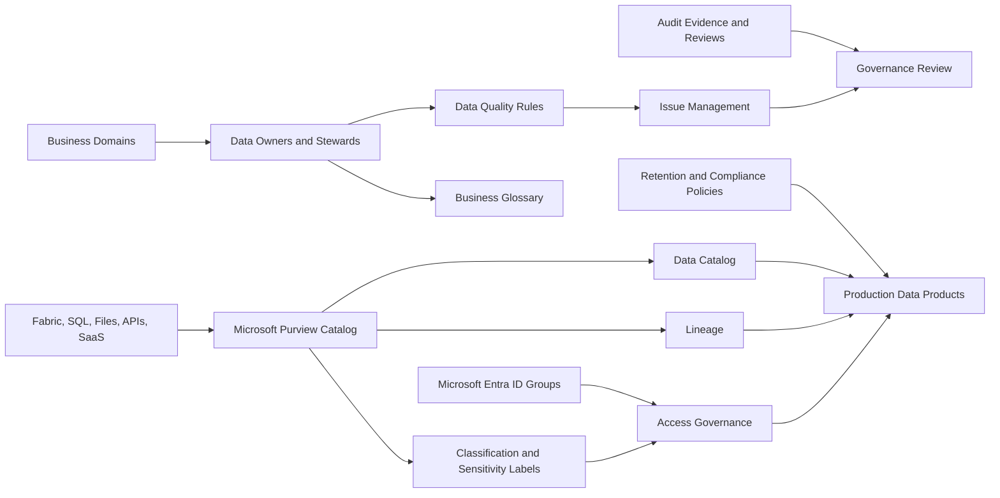

# Data Management Pattern Work

## Purpose

This page defines the repeatable work pattern for implementing data management controls across Fabric, SQL, and related data products.

## Prerequisites

| Prerequisite | Details Needed | Owner |
| --- | --- | --- |
| Governance sponsorship | Executive sponsor, domain owners, data stewards, escalation route | Business / Governance |
| Domain inventory | Domains, data products, owners, critical reports, systems of record | Domain Owners |
| Regulatory requirements | Privacy, retention, audit, residency, data-sharing, contractual controls | Compliance / Legal |
| Classification model | Data classes, sensitivity labels, regulated-data handling requirements | Security / Governance |
| Catalog access | Microsoft Purview access, source registration permissions, scan credentials | Governance / Platform |
| Identity model | Microsoft Entra ID groups for stewards, readers, contributors, approvers | Identity |
| Lineage scope | Critical pipelines, semantic models, reports, warehouses, lakehouses | Data Engineering / BI |
| Quality scope | Critical data elements, rules, thresholds, issue owners, SLAs | Data Owners |
| Operating cadence | Access review cadence, data quality review, governance board, exception process | Governance Lead |

## Architecture Diagram

## Workstreams

| Workstream | Scope | Primary Output |
| --- | --- | --- |
| Governance model | Domains, ownership, stewardship, decision rights, operating cadence | Data governance model |
| Catalog and discovery | Microsoft Purview catalog, source registration, scanning, metadata | Catalog baseline |
| Classification | Sensitivity labels, data classes, regulated data mapping | Classification standard |
| Lineage | Pipeline, dataset, report, and source lineage | Lineage model |
| Data quality | Rules, thresholds, issue management, ownership | Data quality framework |
| Retention and compliance | Retention by data class, audit evidence, policy exceptions | Compliance control set |
| Access governance | RBAC, Entra ID groups, access reviews, least privilege | Access control model |

## Required Inputs

- Business domains and data product ownership
- Data source inventory and critical data elements
- Regulatory, privacy, retention, and audit requirements
- Sensitivity label and classification requirements
- Existing catalog, glossary, lineage, and quality processes
- Access model and Microsoft Entra ID group strategy
- Reporting and executive data-product scope
- Operating model for stewards, platform team, and domain owners

## Implementation Details Needed

| Area | Detail To Capture | Why It Matters |
| --- | --- | --- |
| Domains | Domain name, owner, steward, data products, criticality | Establishes accountability |
| Catalog | Sources to scan, scan frequency, metadata owner, glossary terms | Enables discovery and reuse |
| Classification | Data class, sensitivity label, handling rules, exception process | Supports compliance and secure sharing |
| Lineage | Required systems, pipelines, models, reports, validation method | Supports impact analysis and audit |
| Quality | Critical data elements, rules, thresholds, issue workflow, SLA | Makes trusted data measurable |
| Retention | Retention period, legal hold needs, deletion rules, archive approach | Controls lifecycle and compliance risk |
| Access | Group model, approval workflow, access review cadence, break-glass process | Keeps permissions governed |
| Evidence | Review logs, deployment gates, exception approvals, audit exports | Makes governance defensible |
| Operating model | Stewardship cadence, governance board, KPIs, backlog management | Keeps controls alive after launch |

## Delivery Steps

| Step | Activity | Deliverable |
| --- | --- | --- |
| 1 | Define data domains, owners, and stewardship roles | Governance RACI |
| 2 | Define classification and sensitivity model | Data classification standard |
| 3 | Register priority sources and data products in catalog | Catalog baseline |
| 4 | Configure scan and metadata collection pattern | Scan schedule and source map |
| 5 | Define lineage requirements for production data products | Lineage requirements |
| 6 | Define data quality rules and issue workflow | Data quality rulebook |
| 7 | Define retention, audit, and access review controls | Compliance control matrix |
| 8 | Validate governance controls during release gates | Governance acceptance evidence |
| 9 | Handover stewardship and operating cadence | Governance operating model |

## T-Shirt Pattern Work

| Size | Pattern Work |
| --- | --- |
| Small | Basic ownership, naming, catalog starter, simple classification |
| Medium | Purview starter catalog, source scans, sensitivity labels, access reviews |
| Large | Multi-domain governance, lineage, data quality rules, compliance evidence |
| Enterprise | Federated stewardship, regulated-data controls, formal issue management, chargeback/showback alignment |

## Control Checklist

- Every production data product has a business owner and technical owner.
- Sensitive data is classified before production use.
- Production lineage is available for critical reports and data products.
- Access is granted through Microsoft Entra ID groups and reviewed regularly.
- Retention and audit requirements are mapped to data classes.
- Data quality issues have owners, severity, and remediation workflow.
- Governance controls are part of deployment gates, not after-the-fact cleanup.

## Acceptance Criteria

- Governance model and ownership are approved.
- Catalog and classification baseline is implemented for in-scope data products.
- Lineage and quality controls are implemented for critical production paths.
- Retention, audit, and access review controls are documented.
- Stewardship cadence and operating model are active.
