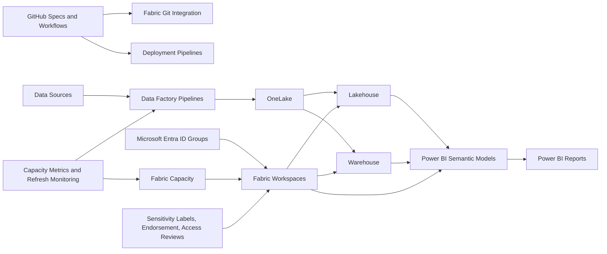

# Fabric Pattern Work

## Purpose

This page defines the repeatable work pattern for deploying Microsoft Fabric as part of the opinionated data platform. Use it to move from sizing and pricing into executable delivery work.

## Prerequisites

| Prerequisite | Details Needed | Owner |
| --- | --- | --- |
| Tenant access | Fabric tenant admin, capacity admin, workspace admin, and security reviewer identified | Platform / Identity |
| Licensing and capacity | Fabric capacity eligibility, Power BI licensing model, reservation assumptions, budget owner | Platform / FinOps |
| Identity model | Microsoft Entra ID groups for admins, engineers, contributors, viewers, and service principals | Identity / Security |
| Source inventory | Data sources, owners, connection methods, refresh frequency, data volume, retention | Data Engineering |
| Workspace model | Domains, environments, workspace naming, ownership, deployment stages | Platform / Domain Owners |
| Governance controls | Sensitivity labels, endorsement model, access reviews, data classification, audit needs | Governance / Security |
| Network and connectivity | Gateway needs, private connectivity requirements, firewall rules, approved data access paths | Network / Security |
| Delivery tooling | GitHub repository, branch strategy, deployment pipeline approach, release approval process | Engineering |
| Acceptance criteria | Performance, security, cost, business validation, support handover, rollback requirements | Product Owner |

## Architecture Diagram

## Workstreams

| Workstream | Scope | Primary Output |
| --- | --- | --- |
| Tenant and capacity | Tenant setting review, capacity selection, capacity assignment, capacity monitoring | Fabric capacity and tenant baseline |
| Workspace model | Domain and environment workspace design | Workspace standards and workspace map |
| OneLake and storage | Lakehouse, warehouse, shortcut, retention, and data-zone patterns | OneLake architecture |
| Data engineering | Pipelines, notebooks, orchestration, data validation, and refresh windows | Data ingestion and transformation pattern |
| BI and semantic layer | Semantic models, reports, certification, endorsement, and refresh rules | Governed analytics consumption pattern |
| Security and governance | Entra ID groups, workspace roles, sensitivity labels, access reviews | Fabric security model |
| Deployment and operations | Git integration, deployment pipelines, monitoring, runbooks, rollback | Fabric release and operations model |

## Required Inputs

- Customer profile and T-shirt size
- Business domains and workspace ownership model
- Data source inventory and ingestion frequency
- Data volume, retention, and growth assumptions
- User roles: admins, engineers, report authors, consumers
- Security requirements: sensitivity labels, RLS/OLS, external sharing, audit
- Environment requirements: dev, test, prod, sandbox, DR if required
- Cost target and capacity planning assumptions

## Implementation Details Needed

| Area | Detail To Capture | Why It Matters |
| --- | --- | --- |
| Capacity | SKU, region, reservation approach, scale rules, non-production schedule | Drives cost, performance, and workload isolation |
| Workspaces | Name, domain, environment, owner, capacity assignment, deployment stage | Creates repeatable governance and release structure |
| Items | Lakehouses, warehouses, pipelines, notebooks, semantic models, reports | Defines the deployable Fabric asset scope |
| Data zones | Raw, cleansed, curated, semantic/consumption zones or equivalent | Keeps data architecture consistent |
| Connections | Source system, auth method, gateway/private connectivity, owner | Prevents unmanaged credentials and release blockers |
| Security | Workspace roles, RLS/OLS needs, sensitivity labels, external sharing policy | Controls access and compliance risk |
| Promotion | Git branch, deployment pipeline stage, approval gate, rollback action | Enables controlled movement from dev to production |
| Monitoring | Capacity metrics, refresh SLA, pipeline alerts, failure routing | Enables production support |
| Cost controls | Budget owner, alerts, showback tags, capacity review cadence | Keeps spend visible and actionable |

## Delivery Steps

| Step | Activity | Deliverable |
| --- | --- | --- |
| 1 | Confirm Fabric tenant settings and admin groups | Tenant settings decision log |
| 2 | Select starting capacity by size and workload | Capacity recommendation |
| 3 | Define domain and environment workspace standards | Workspace naming and ownership standard |
| 4 | Design OneLake, lakehouse, warehouse, and shortcut pattern | Data architecture pattern |
| 5 | Define data pipeline and refresh model | Pipeline orchestration pattern |
| 6 | Define semantic model and report lifecycle | BI delivery standard |
| 7 | Configure Git integration and deployment pipelines | Promotion path |
| 8 | Validate security, performance, monitoring, and cost | Acceptance evidence |
| 9 | Handover runbook and operating model | Operations handover |

## T-Shirt Pattern Work

| Size | Pattern Work |
| --- | --- |
| Small | One domain, basic workspace set, one lakehouse or warehouse, limited reports, basic monitoring |
| Medium | Dev/test/prod workspaces, governed semantic models, repeatable pipelines, Git integration |
| Large | Multi-domain workspace factory, deployment gates, capacity review, formal security and support model |
| Enterprise | Federated domains, chargeback/showback, enterprise governance, formal release and operating model |

## Acceptance Criteria

- Fabric capacity and workspace model are approved.
- Workspace access uses Microsoft Entra ID groups.
- Data products follow the agreed OneLake, lakehouse, warehouse, and semantic model standards.
- Deployment uses approved Git and promotion controls where supported.
- Monitoring, cost review, and operational runbook are in place.
- Production release has business, security, and platform sign-off.
